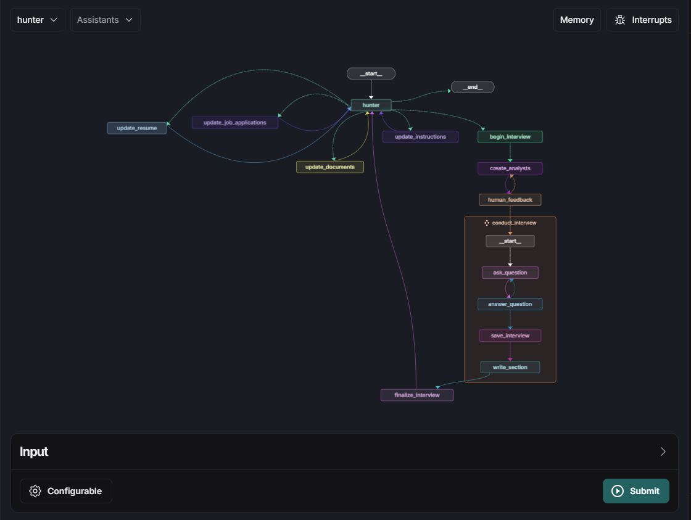

# UnemployeesVs

## Backend

### Setup
Create a conda environment with python 3.11

```bash
conda create -n hunter python=3.11 -y
conda activate hunter
```
Install the required packages
```bash
python3 -m pip install -r requirements.txt
```

Setup Docker using the instructions found [here](https://docs.docker.com/engine/install) if you do not already have Docker set up

To use docker within the conda environment, and user to docker group

```bash
sudo usermod -aG docker $USER
newgrp docker
docker ps # verify that you have acces to docker
```

Create a `.env` following the `.env-example` with your openAI and LangChain API keys entered

Additionally, navigate to `backend/deployment` and create a `docker-compose.yml` file following the `docker-compose-example.yml` file with the API keys filled in

### Deploy

Deploy with LangGraph

```bash
cd backend/deployment
langraph built -t hunter-test
docker compose up
```

Sign into [LangSmith website](https://smith.langchain.com/) on your browser and navigate to the LangGraph Platform tab and launch LangGraph Studio




### [Demo Usage Video](https://drive.google.com/file/d/1bKYv5_1ReoccnZfbohWsKySeWMOvwAOl/view?usp=sharing)

### Agent Workflow

#### Job Seeker (Unemployee) Facing

There are three key aspects in this agent workflow.

- **Long Term Memory**: The "hunter" agent has accese various types of long term memory that is related to the user's professional and academic carreer with the goal of creating a candidate persona that mimics user's experiences, skills, and accomplishments.

- **AI Roleplay**: When a user is ready for apply for a job interview, they can proceeed by simply saying so and the hunter agent will initiate the interview process by creating analysts that will interview a candidate in the user's stead. This involves creating a set of analysts that are informed by the job posting and user's resume. The analysts will begin by asking questions from a candidate that is informed by the user's profile. This interview roleplay will carry on and the analysts will create memos reporting on the strengths and weaknesses of the candidate. A final evaluation of the candidate fit for the job through the lens of each analyst.

- **Human-in-the-Loop**: Before the expert analysts conduct their interviews, the user is prompted to verify that they are satisfied with the personas of the analysts. If the user would like the analysts to focus on a specific aspect of their professional/academic career, the user can simply say so, and the agent will generate appropriate analysts that satisfy the user's requirements. 

This system leverages human-in-the-loop feedback to refine insights by integrating user inputs, ensuring personalized suggestions for improvements to their resume. AI roleplay simulates realistic interviews, allowing the system to evaluate responses, while long-term memory stores insights and improvements for continuous resume enhancement over multiple sessions.

#### Recruitor-Facing

The agentic workflow enables gain a greater and granular understanding of the candidates while requiring minimal effort from the recruiter. Recruiter's are able to get valuable insights into the potential strengths and weaknesses of a candidate via the lens of expert analysts.